# 噜噜桌宠 LuluPet

> 住在 macOS 桌面上的水豚噜噜 / 噜妹。一个人用，它安安静静陪你；两个人用，想 TA 的时候，
> 让自己的小水豚**跑到 TA 的桌面上去串门**，送一颗爱心、一句话、一个表情。


<sub>[▶ 高清视频](docs/demo/visit.mp4)</sub>

平台：macOS 14+，Apple 芯片（M1 及以后）· 下载：[Releases 里的 LuluPet.zip](https://github.com/richardzhuang0412/LuluPet/releases/latest)（约 190 MB）·
完整功能说明：[docs/features.md](docs/features.md) · 更新日志：[CHANGELOG.md](CHANGELOG.md)

> **非商用 · 素材版权归原作者**：「水豚噜噜」形象和动图版权归原作者，本项目只供个人、粉丝向、非商业使用，侵删。
> 代码是 MIT 协议，素材不在 MIT 范围内，详见 [版权与素材](#版权与素材)。

<!-- recent-changes:start -->
## 最近更新

**v0.16.0（2026-10-04）**

- 更安全的一键更新：只安装带正确签名的官方版本，被改动过的包会直接拒绝
- 没网时发的消息不会丢了：先存在本地，退出重开也会在联网后补发，而且只发一次
- 设置 →「通用」里可以打开「开机自动打开」，第一次打开时也能顺手勾上
- 修好一批问题：定时勿扰到点会自己结束；合盖睡眠的时间不再算进喝水 / 站立提醒；离线攒了很多话时只播最近 50 条，其余在「记录」里
- 安装、隐私、卸载说明重写得更清楚，Firebase 设置也加了常见问题对照表

**v0.15.6（2026-10-04）**

- 出门找 TA 时多了几句台词：噜噜会说「噜妹～我来了」「来了，噜妹」，噜妹会说「走走走」

**v0.15.5（2026-10-04）**

- 待设置里 TA 版本旧时，可以一键「叫 TA 升级」；TA 是新版的话，收到后直接点「一键更新」

完整的更新日志见 [CHANGELOG.md](CHANGELOG.md)。
<!-- recent-changes:end -->

---

## 目录

1. [功能一览](#功能一览)
2. [安装（3 步）](#安装3-步)
3. [第一次打开](#第一次打开)
4. [两个人用：Firebase 设置](#两个人用firebase-设置)
5. [常见问题](#常见问题)
6. [隐私](#隐私)
7. [卸载](#卸载)
8. [版权与素材](#版权与素材)
9. [开发者](#开发者)

---

## 功能一览

> 演示都是 App 自己渲染的（`tools/make_demos.sh`）：前面几张是动图，其余是封面图，点一下封面就能看高清视频（MP4）。两个桌面并排时，左边是你的，右边是 TA 的。
> 每个功能的详细用法和设置位置见 [docs/features.md](docs/features.md)。

### 日常陪伴

待机、随机小动作，单击它冒爱心；一会儿没人理就安静地站好，几乎不耗电。拖到哪儿就待在哪儿，全屏时自动躲起来。

[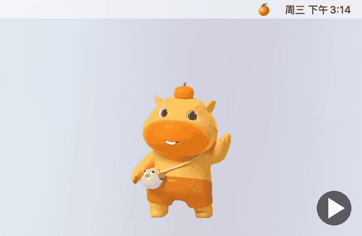](docs/demo/daily.mp4)

<sub>▶ 点图片看视频</sub>

### 串门送信与见面互动

双击宠物打开传话面板：发爱心、文字、表情（顶上是你自己挑的 8 格「快捷栏」，下面「常用」按发过的次数自动排，点「更多表情…」展开 77 个，按心情分组；设置 →「表情」（拖动就能调顺序，快捷栏旁的 ⚙︎ 直达）或右键表情来摆快捷栏），或者直接「去找 TA」。自己的宠物会**亲自跑去 TA 的桌面**送，
两只见面抱抱、亲亲、跳舞……TA 点「收到 ❤️」后再跑回来说「送到啦」（就是最上面那张图）。TA 不在线时，消息先存着，上线就补收。


<sub>[▶ 高清视频](docs/demo/compose.mp4)</sub>

### 撞车

两个人同时发：先在一边见面，再一起走到另一边见一面，最后各回各家。

[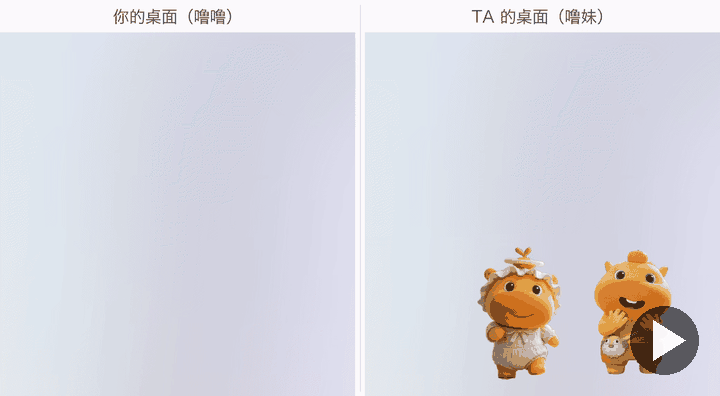](docs/demo/collide.mp4)

<sub>▶ 点图片看视频</sub>

### 勿扰

🍊 菜单 →「勿扰模式」：选个心情（😤 生气中 / 💼 忙碌中 / 😴 休息中 / 🤐 不说原因）和时长。这期间 TA 发的都先攒着；
关掉勿扰时，TA 的宠物送来一张「诚意清单」。

[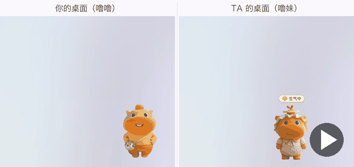](docs/demo/dnd.mp4)

<sub>▶ 点图片看视频</sub>

### 换装和大小

噜噜 11 套、噜妹 9 套造型（含节日限定），自动轮换，也能「选择造型」直接挑；鼠标移上去，拖右下角的小圆点等比例缩放。

[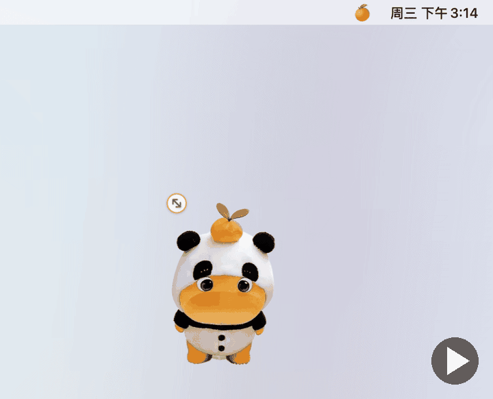](docs/demo/outfits.mp4)

<sub>▶ 点图片看视频</sub>

### 番茄钟 / 喝水 / 站立提醒

传话面板的「小工具」页或 🍊 菜单里打开：番茄钟专注时宠物捧着书陪你，TA 也能看到你在专注；喝水、站立提醒只算你在用电脑的时间。

[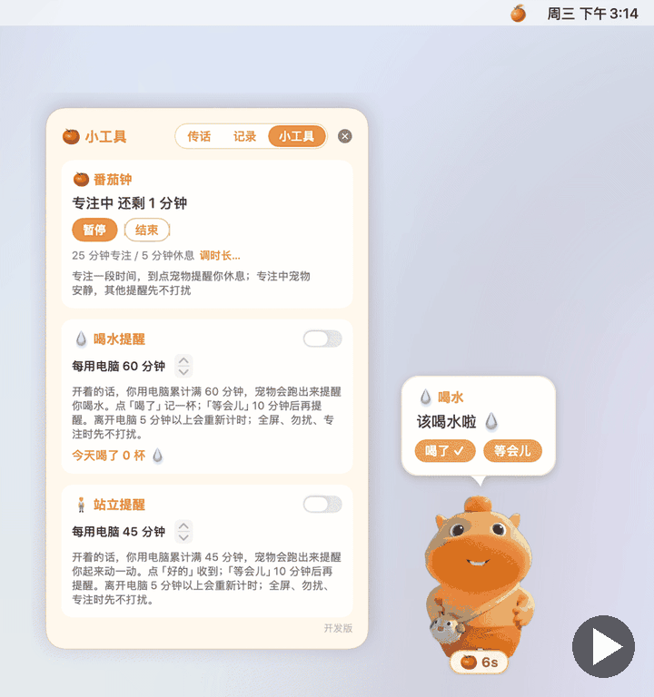](docs/demo/tools.mp4)

<sub>▶ 点图片看视频</sub>

### 叫 TA 喝水

传话面板里点「💧 叫 TA 喝水」或「🧍 叫 TA 起来动动」：你的宠物跑过去叫 TA，TA 点「喝了 ✓」或「等会儿」，你这边都会收到回话（「TA 说马上喝 💧」/「TA 说等会儿再喝 ⏰」）；TA 等会儿之后真的喝了，还会再告诉你一句「TA 终于喝啦」。

[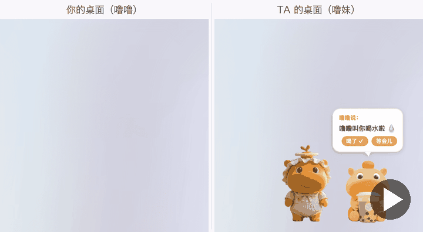](docs/demo/remind.mp4)

<sub>▶ 点图片看视频</sub>

### 声音和背景音乐

串门、抱抱、亲亲、爱心、气泡都有小小的音效，有些互动还带专属的声音（比如抱抱时说「我想你了」）。默认开、音量「小」，隐藏时完全不出声；
可以在 🍊 →「声音」（或 设置 → 通用 →「声音」）里关掉、调音量，或打开背景音乐（默认关，只在启动时放一首，不循环）。

### 三种模式：一个人 / 情侣 / 朋友

- **一个人**：桌面上一只自己的宠物，不用配对、不用 Firebase。
- **情侣**：一个人是噜噜、一个人是噜妹，会串门、亲亲、抱抱。
- **朋友**：两个人可以选同一个角色，串门、传话照样有，亲密的动作自动换掉。

[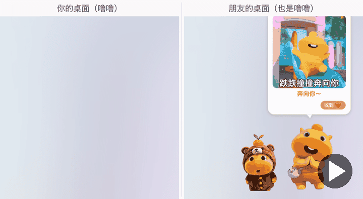](docs/demo/modes.mp4)

<sub>▶ 点图片看视频</sub>

[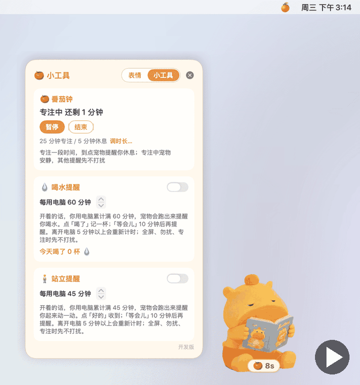](docs/demo/solo.mp4)

<sub>▶ 点图片看视频</sub>

### 天气卡 + 想 TA 泡泡

在设置里选好城市：传话面板顶部显示你们两边的天气和当地时间，TA 那一行还标着 TA 现在的状态（在线 / 离线多久 / 勿扰 / 专注）；宠物偶尔会「想 TA」，头顶冒个泡泡，里面是 TA 和 TA 那边的天气
（鼠标停在宠物上也会冒）。泡泡里的 TA 和 TA 桌面上一模一样：穿着同一套造型，TA 在睡觉 / 专注 / 勿扰 / 撑伞，泡泡里也是。宠物还会跟着你那边的天气偶尔换个样子。
想马上看看 TA 在干嘛：传话面板里点「👀 偷看」，或菜单里点「偷看 TA 👀」，立刻拿到 TA 最新的造型和状态（TA 不在线就看 TA 最后的样子；TA 不会知道）。
在美国，温度和天气用附近气象站的实测数据（更准）；其他地方用天气预报模型。也可以在设置里打开「使用我现在的位置」，让城市自动跟着你走。

[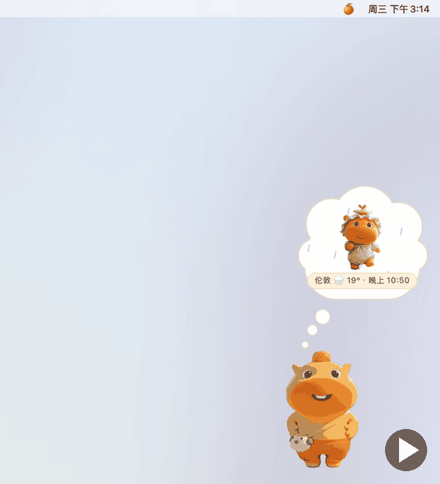](docs/demo/weather.mp4)

<sub>▶ 点图片看视频</sub>

[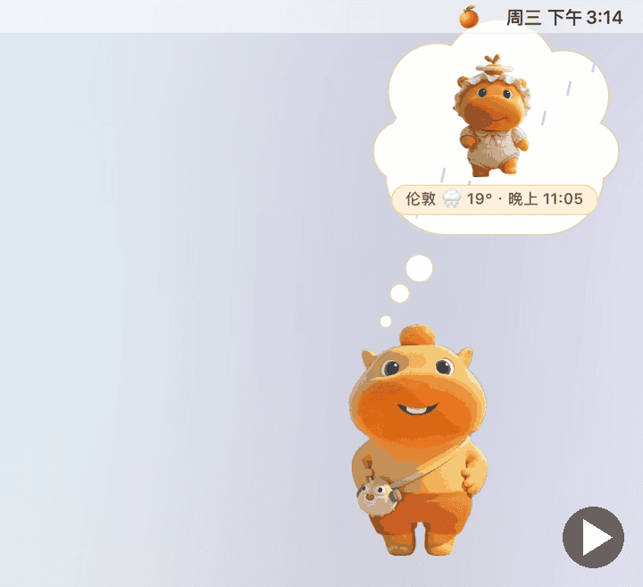](docs/demo/think.mp4)

<sub>▶ 点图片看视频</sub>

### 更新日志 + 待设置

升级后宠物冒个小卡片，点「看看」就能看到这一版多了什么；「待设置」列出还没设置的新功能。随时可以在 🍊 →「更新日志…」里翻看。

[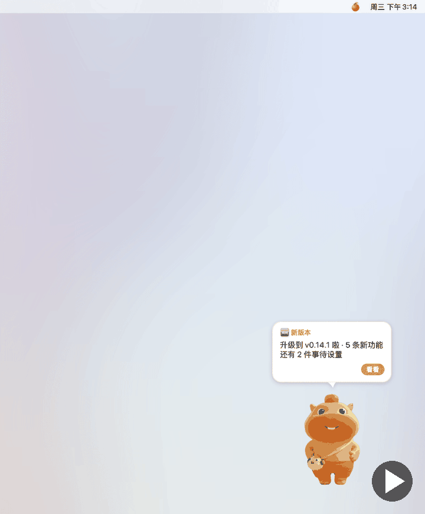](docs/demo/whatsnew.mp4)

<sub>▶ 点图片看视频</sub>

### 一键更新

有新版本时宠物会冒「有新版本 · 更新」，点一下就自动下载、替换、重启，聊天记录和设置都不会丢；也可以随时点 🍊 →「检查更新…」。TA 的版本比你旧时，在「待设置」里点「📣 叫 TA 升级」就会给 TA 发一条提醒，TA 收到后也能直接点「一键更新」。（v0.14.0 以前的版本需要先手动装一次新版，见 [怎么更新](#常见问题)。）

[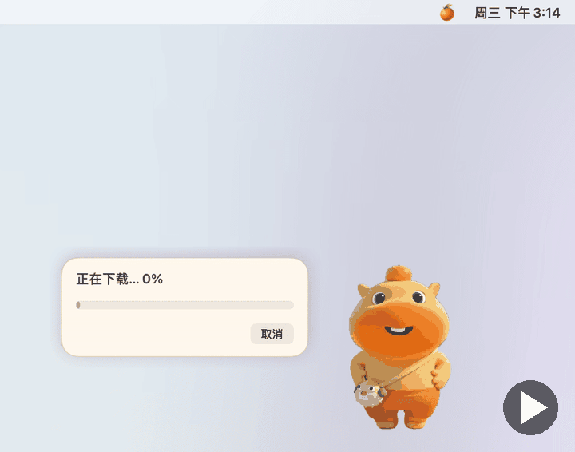](docs/demo/update.mp4)

<sub>▶ 点图片看视频</sub>

---

## 安装（3 步）

> 系统要求：**macOS 14 或更新，Apple 芯片（M1 及以后）**。安装包约 190 MB。Intel Mac 暂时没有打包好的版本，请看 [开发者](#开发者) 自己构建。

1. **下载**：到 [Releases](https://github.com/richardzhuang0412/LuluPet/releases/latest) 下载 `LuluPet.zip`。
2. **拖进「应用程序」**：双击解压，把 **LuluPet**（噜噜桌宠）拖进「应用程序」文件夹。
   **一定要先拖进应用程序再打开**（直接在「下载」文件夹里打开的话，「一键更新」用不了）。
3. **第一次打开**：这个 App 没有付费的苹果开发者签名，第一次打开系统会拦一下，按你的系统版本放行一次就好：

   **macOS 15 / macOS 26（新系统）**
   1. 在「应用程序」里双击 LuluPet，会弹出「未打开『LuluPet』」，**这个弹窗里没有「打开」按钮，点「完成」**。
   2. 马上打开 **系统设置 → 隐私与安全性**，往下滚到「安全性」，会看到「已阻止使用『LuluPet』」，点它旁边的 **仍要打开**。
      （这一项大约只保留 1 小时，过了就再双击一次 LuluPet，让它重新出现。）
   3. 输入你的 Mac 开机密码确认，再弹出的窗口里再点一次 **仍要打开**。

   **macOS 14**：在「应用程序」里**右键点 LuluPet → 打开**，弹窗里再点「打开」。

   **更快的办法（任何系统都行）**：打开「终端」，粘贴下面这一行回车，然后正常双击打开：

   ```bash
   xattr -dr com.apple.quarantine /Applications/LuluPet.app
   ```

   <!-- TODO(screenshots): 2 张截图——(1) macOS 15/26 的「未打开『LuluPet』」弹窗（只有「完成」）；(2) 系统设置 → 隐私与安全性 里的「仍要打开」。放进 docs/install/ 后在这里引用。 -->

只需要第一次这样，以后双击就能开；也可以在 设置 → 通用 里打开「开机自动打开」。App 没有程序坞图标，只在右上角菜单栏有个 🍊（设置里可以打开程序坞图标）。
如果提示「已损坏，无法打开」，也是同一个原因，用上面的终端那一行就好。

## 第一次打开

第一次打开会弹出**欢迎窗**，一步步带你设置好（之后都能在 🍊 →「设置…」里改）：

1. **选模式**：一个人 / 情侣 / 朋友。
2. **选角色**：噜噜还是噜妹。情侣模式两个人要选不同的；朋友模式可以一样。
3. **选城市**（可以跳过）：用来显示天气，宠物也会跟着天气换样子；只分享城市。一个人模式这是最后一步，直接点「开始」
   （没选城市也能开始）；情侣 / 朋友模式没选城市时按钮是「跳过」，点了进入下一步。
4. **配对**（情侣 / 朋友）：填配对码和 Firebase 数据库地址，见下一节，填好点「开始」。一个人模式没有这一步。

最后一步下面有个「开机自动打开（推荐）」，默认勾着：登录 Mac 后宠物自动出现，不用每次手动开。不想要就取消勾选，之后也能在 设置 → 通用 里改。

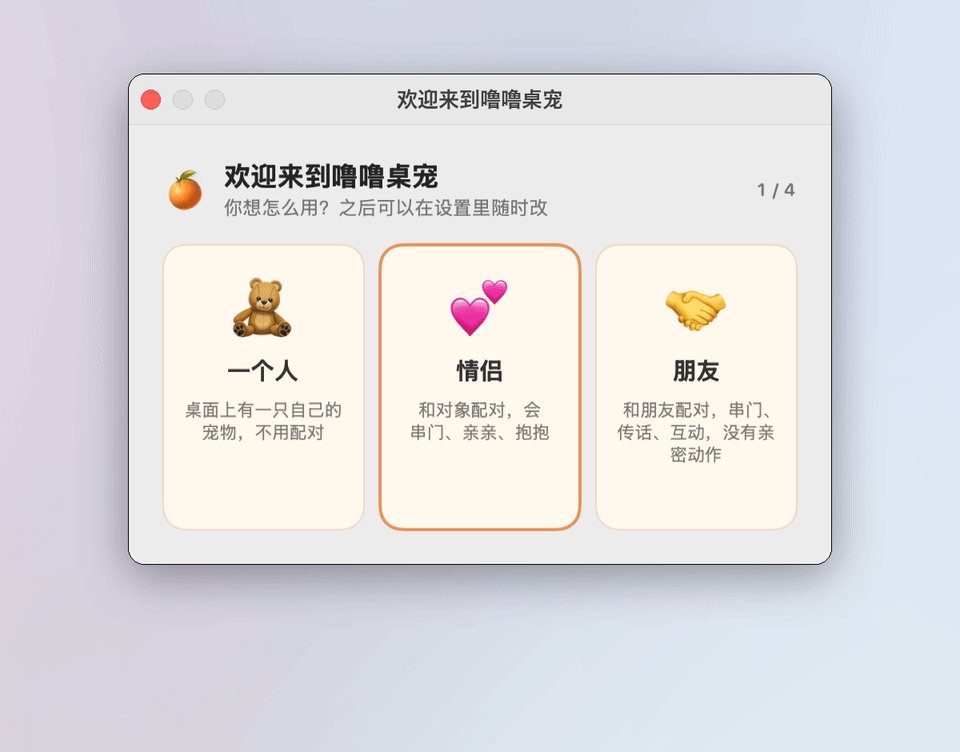

<sub>[▶ 高清视频](docs/demo/welcome.mp4)</sub>

## 两个人用：Firebase 设置

LuluPet 没有公共服务器：两个人用**你们自己的**免费 Firebase 实时数据库来传消息。只需要**一个人**建一次，大约 10 分钟，
最后得到一个地址，长这样：`https://你的项目-default-rtdb.firebaseio.com`。

完整图文步骤（建项目、建数据库、粘贴安全规则、复制地址）：**[docs/firebase-setup.md](docs/firebase-setup.md)**。

建好后两个人在欢迎窗（或 🍊 → 设置… → 通用）里：

- **情侣**：一个人选「我是噜噜」，另一个人选「我是噜妹」；**只让一个人**点「生成」，把配对码发给对方，对方填进去。
- **朋友**：角色随便选；**一个人**点「生成」把配对码发给对方，**另一个人**点「粘贴」。
- 两个人填**同一个**数据库地址，点「保存」（欢迎窗里是「开始」）。菜单栏 🍊 里显示「对方在线」就连上了。

> 配对码相当于你们俩的钥匙，不要发到公开的地方。

> **在中国大陆用？** Firebase 是 Google 的服务，两个人的网络都要能访问 `firebaseio.com`（可能需要能访问 Google 服务的网络）。
> 连不上时菜单里会显示「未连接：网络断开，正在重试」。一个人模式不需要 Firebase，不受影响。

## 常见问题

**宠物不见了？**
按 **⌃⌥L**（Control + Option + L）显示 / 隐藏；或点菜单栏 🍊 →「显示」。可能是之前点了「隐藏」，或者当前屏幕在全屏。
菜单栏也没有 🍊 的话，说明 App 没在运行，到「应用程序」里再打开一次。

**全屏时宠物躲起来了？**
这是故意的：看视频、开会共享屏幕时不打扰。退出全屏就回来；全屏时按 ⌃⌥L 也能叫出来。不想要的话：🍊 → 设置… →
取消「全屏时自动隐藏」。

**快捷键是什么？能改吗？**
⌃⌥L 显示 / 隐藏，⌃⌥M 打开传话面板，⌃⌥Q 退出。🍊 → 设置… →「快捷键和显示」里点一下框框，再按新的组合键就能改。

**收不到消息 / 显示「未连接」？**
两个人的**配对码**和**数据库地址**必须一模一样；Firebase 的安全规则要点过「发布」；网络要能访问 `firebaseio.com`。
菜单最上面一行会写原因（比如「数据库地址有误 (HTTP 404)」「数据库规则拒绝访问」），每一种怎么办见
[firebase-setup.md 的常见问题](docs/firebase-setup.md#常见问题)。两边都显示「在线」却都说对方离线，多半是配对码差了一个字符。

**怎么让宠物开机自动出现？**
🍊 → 设置… → 通用 →「开机自动打开」勾上就行（第一次打开时的欢迎窗里也问过）。如果提示「还差一步」，
去 系统设置 → 通用 → 登录项，把「噜噜桌宠」允许打开。要先把 App 放进「应用程序」文件夹，这个开关才能用。

**菜单里提示「配对冲突」？**
两台电脑占了同一边：情侣模式是两个人选了同一个角色，朋友模式是两个人都点了「生成」。让其中一个人改一下：
情侣改选另一个角色，朋友改成点「粘贴」（配对码不变）。改好后提示自己消失。

**天气不准？**
天气大约每 30 分钟更新一次：在美国用附近（25 公里内）气象站的实测温度和天气，其他地方来自 Open-Meteo 的预报模型，
显示的是城市的整体天气，和你窗外可能差一点。城市选错了：🍊 → 设置… →「我的城市」→「更改」，
或者勾上「使用我现在的位置」让它自动定位（要在系统设置的定位服务里允许噜噜桌宠）。

**怎么更新？**
v0.14 起直接点 🍊 →「检查更新…」（有新版本时宠物也会冒出「有新版本 · 更新」）。要先把 App 放在「应用程序」文件夹里，一键更新才能用。
更早的版本，或者一键更新失败时：到 [Releases](https://github.com/richardzhuang0412/LuluPet/releases/latest) 下载新的 `LuluPet.zip`，
先 🍊 →「退出」，再把「应用程序」里的旧版替换成新的，打开即可。**聊天记录、设置都会保留。**
两个人最好都升级到同一版（TA 升级了，你这边会冒气泡提醒）。

## 隐私

LuluPet 没有作者的服务器，不收集任何数据。它会联网做的事情，全部在这里：

| 什么时候 | 连到哪里 | 发了什么 |
|---|---|---|
| 每天一次检查更新（也可以手动点「检查更新…」） | GitHub（`api.github.com`，你下载的就是这里的 Release） | 只是读最新版本号，不带任何个人信息；GitHub 照常能看到你的 IP |
| 设置了城市时，每 30 分钟左右查天气 | Open-Meteo（`api.open-meteo.com`） | 城市的经纬度（保留两位小数） |
| 设置了城市、并且在美国时 | 美国国家气象局（`api.weather.gov`） | 同一个城市的经纬度，用来查附近气象站的实测温度 |
| 在设置里搜城市时 | Open-Meteo 的地名搜索（`geocoding-api.open-meteo.com`） | 你输入的城市名 |
| 情侣 / 朋友模式 | **你们自己的 Firebase**（`firebaseio.com`） | 消息、在线状态等，见下面「TA 能看到什么」 |

- **一个人模式**：没有 Firebase，也不连任何配对相关的服务。联网的只有上面的每日更新检查，以及（你选了城市时）天气。
  没选城市就没有天气请求。
- **TA 能看到什么**（只有知道配对码的两个人能读写，存在你们自己的 Firebase 里）：你发的消息；你的在线 / 离线和最后在线时间；
  你的角色、模式和 App 版本；宠物现在穿的造型和在干嘛（睡觉 / 专注 / 勿扰 / 撑伞）；勿扰的心情和专注还剩几分钟；**你的城市名**和那边的天气。
  TA **看不到**你的精确位置、你在用什么软件、你的屏幕内容。
- 「使用我现在的位置」**默认关闭**。打开后只在本机读一次大致位置（精度约一公里），变成城市名；精确位置不会离开这台 Mac，
  TA 只看到城市名。
- **数据存在你的 Mac 上哪里**：聊天记录在 `~/Library/Application Support/LuluPet/`；设置在系统的偏好设置里
  （`com.lulupet.app`）；日志在 `~/Library/Logs/LuluPet/`（运行状态、错误，也会记下收发消息的文字；只存在本机、不会上传，超过 5 MB 自动轮换。把日志发给别人求助之前，请先看一眼）。

## 卸载

1. 🍊 →「退出」。
2. 把「应用程序」里的 **LuluPet** 拖进废纸篓。如果开过「开机自动打开」，这一项会跟着失效（也可以先在 设置 → 通用 里关掉，
   或到 系统设置 → 通用 → 登录项 里删掉）。
3. 想**彻底清掉**自己的数据（可选，聊天记录会一起删掉）：在「终端」里运行

   ```bash
   rm -rf ~/Library/Application\ Support/LuluPet ~/Library/Logs/LuluPet
   defaults delete com.lulupet.app
   ```

4. 两个人用的话，Firebase 里的消息在你们自己的项目里：不想留就去 Firebase 控制台删掉那个数据库或整个项目
   （只会影响你们两个人）。

## 版权与素材

- **代码**：[MIT 协议](LICENSE)。
- **角色形象和动图**（`assets/`、`Resources/` 下的素材）：**不在 MIT 范围内**。「水豚噜噜」形象属于动画《平头哥》少年篇的版权方；
  动画片段来自 B 站二创作者和表情包网站，版权归原作者所有。本项目没有获得授权，与版权方无关。
- 素材只供**个人、粉丝向、非商业**使用：请不要拿去售卖、商业推广或上架应用商店。
- 每个文件的出处见 [`assets/gifs/SOURCES.txt`](assets/gifs/SOURCES.txt)，完整说明见 [NOTICE.md](NOTICE.md)。
- **侵删**：版权方或原作者如果不希望素材出现在这里，请开 issue，会尽快删除。

---

## 开发者

**环境**：macOS 14+，Xcode Command Line Tools（`xcode-select --install`，Swift 6+），不需要完整的 Xcode。
生成好的 `Resources/` 已经提交，平时构建不需要 Python。

```bash
./scripts/setup.sh                        # 检查环境 + 构建 dist/LuluPet.app 和 dist/LuluPet.zip（新手推荐）
./scripts/build_app.sh                    # 只构建、打包、ad-hoc 签名
./scripts/build_app.sh --rebuild-assets   # 先从 assets/ 重新生成 Resources/（需要 Python 3 + Pillow）
```

开发时直接运行：

```bash
swift build
LULU_RESOURCES=$PWD/Resources .build/debug/LuluPet --profile devA   # 每个 profile 有独立的设置和记录
```

**测试**：

```bash
swift run LuluCoreTests       # 纯逻辑测试，必须全部通过
```

**本机两只宠物互测**：`scripts/test_pair.sh start --local` 在这台 Mac 上开两只测试宠物（独立的 profile 和测试配对码），
用本机假服务器 `tools/fake_firebase.py`，完全不联网；`stop` 关掉，`reset` 清空测试数据。不加 `--local` 则连你现有的 Firebase
（单独的测试配对码，碰不到正式记录）。

**演示动图**：`tools/make_demos.sh [场景…]` 重新生成 `docs/demo/` 里的 GIF / MP4（测试实例在屏幕外、临时 profile、静音下跑，
屏幕上什么都看不到）。README 只放首页大图和两张小动图，其余用封面图链到 MP4：重新生成后跑
`build/demo-venv/bin/python tools/make_posters.py [名字…]` 更新 `docs/demo/posters/`（需要 Pillow）。

**项目结构**：`Sources/LuluCore`（纯逻辑，全部有测试）、`Sources/LuluSync`（Firebase REST + 实时推送）、`Sources/LuluPet`
（AppKit + SwiftUI 界面）、`assets/`（素材清单和源 GIF）、`Resources/`（生成的 App 素材）、`tools/`（素材管线、假数据库、演示）。

**升级兼容**：用户的聊天记录在任何升级后都必须完整保留。改代码前请先读 [docs/upgrade-compat.md](docs/upgrade-compat.md)
（bundle id、UserDefaults 键、Firebase 路径、消息字段只能新增，不能改名或删除）。

**发版时更新文档**：见 [docs/DOCS_SYNC.md](docs/DOCS_SYNC.md)。

欢迎提 issue 和 PR。每个 PR 需要 `swift build` 没有新警告、`swift run LuluCoreTests` 全部通过，界面改动附截图；新素材写清楚来源。

**发布签名（一键更新只信签过名的包）**：App 内置一把 Ed25519 **公钥**（`Sources/LuluCore/UpdateKey.swift`），
`scripts/release.sh` 用对应的**私钥**给 `dist/LuluPet.zip` 签名，把签名 `LuluPet.zip.sig` 作为第二个 release 附件一起传上去；
App 下载后先验签再安装，验不过就拒绝。私钥**绝不进仓库**，存在发版那台 Mac 的 `~/.config/lulupet/update_signing_key`（权限 0600，
可用环境变量 `LULUPET_SIGNING_KEY_FILE` 换位置）。

```bash
scripts/update_signing_key.sh init     # 第一次：生成密钥，把公钥写进 UpdateKey.swift（然后提交它）；已有密钥会拒绝
scripts/update_signing_key.sh pubkey   # 打印公钥
scripts/update_signing_key.sh sign F   # 打印文件 F 的 base64 签名
scripts/update_signing_key.sh verify F F.sig   # 用 UpdateKey.swift 里的公钥验证
```

- **一定要备份私钥**（密码管理器里存一份）。丢了就再也发不出已装用户能更新的版本。
- `UpdateKey.swift` 里是占位符时验签**一律失败**：这样的 build 不会安装任何更新，`release.sh` 也拒绝发版。
- **换密钥**（只有私钥泄露 / 丢失才需要）：已装的 App 只认**旧**公钥，所以过渡版 N 必须用**旧**私钥签名、同时 `UpdateKey.swift` 里换成**新**公钥；
  装上 N 的用户之后只认新私钥，N+1 起用新私钥签。`release.sh` 会因为「编进去的公钥 ≠ 本机私钥」拒绝发 N，所以 N 要手动发：
  构建后 `LULUPET_SIGNING_KEY_FILE=<旧私钥> scripts/update_signing_key.sh sign dist/LuluPet.zip > dist/LuluPet.zip.sig`，
  再用 `gh release create` 同时上传 zip 和 `.sig`。私钥丢了的话没法这样过渡，已装用户得手动装一次新版。
- 测试用临时密钥：`LULUPET_SIGNING_KEY_FILE=/tmp/k LULUPET_UPDATE_KEY_SWIFT=/tmp/K.swift scripts/update_signing_key.sh init`
  不会碰真实密钥或仓库文件。
