# 噜噜桌宠 · 功能介绍

这里是每个功能的详细说明：它做什么、怎么用、在哪里设置。简短版见 [README 的功能一览](../README.md#功能一览)；
每一版具体改了什么，在 App 里 🍊 →「更新日志…」查看。

> 常用入口：
> - **菜单栏 🍊**（或右键宠物）：状态、去找 TA、隐藏、勿扰模式、番茄钟、提醒、声音、大小、造型、设置…、更新日志…、退出。
> - **传话面板**：双击宠物或按 ⌃⌥M。标签页：传话 / 记录 / 小工具（一个人模式是：表情 / 小工具）。
> - **设置**：🍊 →「设置…」，分「通用」和「小工具」两页。

## 目录

- [日常陪伴](#日常陪伴)
- [传话面板和记录](#传话面板和记录)
- [串门送信与见面互动](#串门送信与见面互动)
- [TA 不在 / 离线消息](#ta-不在--离线消息)
- [撞车](#撞车)
- [勿扰模式和诚意清单](#勿扰模式和诚意清单)
- [隐藏和全屏](#隐藏和全屏)
- [换装](#换装)
- [大小](#大小)
- [番茄钟](#番茄钟)
- [喝水 / 站立提醒](#喝水--站立提醒)
- [叫 TA 喝水 / 起来动动](#叫-ta-喝水--起来动动)
- [三种模式](#三种模式)
- [天气卡、天气造型和想 TA 泡泡](#天气卡天气造型和想-ta-泡泡)
- [更新日志和待设置](#更新日志和待设置)
- [版本提醒和更新](#版本提醒和更新)
- [声音](#声音)
- [快捷键](#快捷键)
- [省电](#省电)
- [设置一览](#设置一览)

---

## 日常陪伴

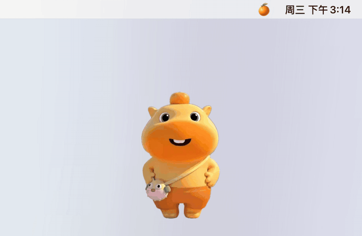

- **它做什么**：宠物住在桌面上（透明、置顶，所有桌面空间都看得到），空闲时每隔一两分钟随机做个小动作（眨眼、挥手、转圈、跳舞……）。
  2 分钟没人理就停成一个安静的姿势，15 分钟后闭眼打瞌睡；鼠标移上去、点它、来消息时立刻醒来。
- **怎么用**：**单击**逗它玩（冒爱心，不会发任何东西）；**拖动**把它放到任何位置，下次打开还在那里；**双击**打开传话面板。
- **在哪里设置**：没有需要设置的；角色在 设置 → 通用 →「我的角色」里选。

## 传话面板和记录

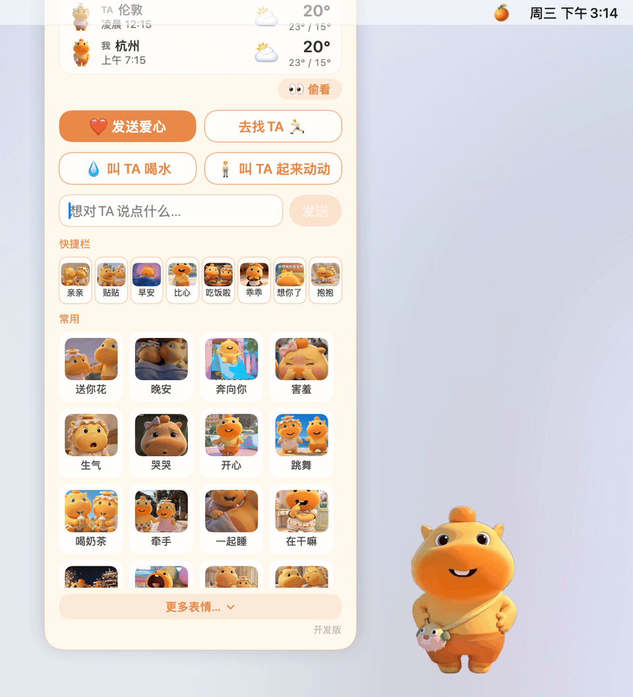

- **它做什么**：给 TA 发东西的地方，也能翻你们所有的消息。
- **怎么用**：双击宠物或按 ⌃⌥M。
  - **传话**：「❤️ 发送爱心」「去找 TA 🏃」「💧 叫 TA 喝水」「🧍 叫 TA 起来动动」，输入文字（最多 500 字）点「发送」，
    或点下面 24 个快捷表情之一。顶部是天气卡（见 [天气](#天气卡天气造型和想-ta-泡泡)），右下角是当前版本。
  - **记录**：按天分组，最新的在最下面，往上滚可以一直往回翻；勿扰的时段也会标出来（😤 勿扰中 14:05–15:10）。
  - **小工具**：番茄钟、喝水和站立提醒，见下面。
- **在哪里设置**：快捷键在 设置 → 通用 →「快捷键和显示」。

## 串门送信与见面互动

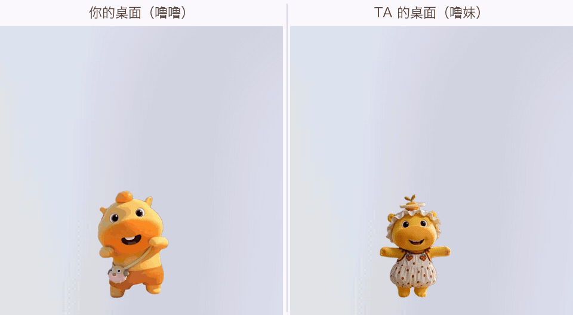

- **它做什么**：你发的每样东西（爱心、文字、表情、去找 TA）都由你的宠物**亲自跑去送**：跑出屏幕边，出现在 TA 的桌面上，
  两只见面随机互动（抱抱、亲亲、贴贴、跳舞、安慰、靠肩膀……，不同表情有不同的互动），然后冒气泡。TA 点气泡右下角的
  「收到 ❤️」（或点气泡）就是收到了；都收到后，你的宠物跑回来说「送到啦 ❤️」。
- **细节**：
  - TA 的宠物正好在你这儿做客时，就地见面，不用跑。
  - 来做客的宠物最多待 45 秒（有新消息就重新计时），到点挥手回家；没来得及看的消息变成「TA 留下的话」挂在你的宠物头上，不会丢。
  - 你的宠物出门时 TA 发来的消息先攒着，回家后一起给你看。
  - 串门时把两只拖到一起，会合体播放一段互动。
  - 来串门的宠物穿着 TA 那边现在的造型。
- **在哪里设置**：不用设置，配对好就有。

## TA 不在 / 离线消息

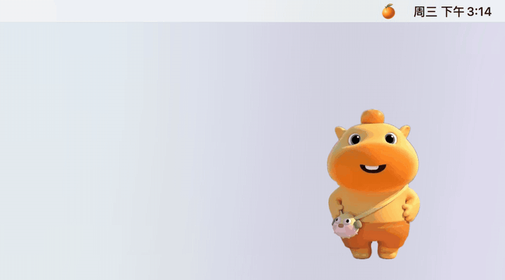

- **它做什么**：TA 的 App 没开或电脑睡眠时，你的宠物跑到屏幕边上找一圈，回来告诉你「TA 不在，先放在 TA 那儿啦」。
  文字和表情会存在你们的 Firebase 里，TA 下次打开时一条不落地补收。
- **状态在哪看**：🍊 菜单最上面一行：对方在线 / 对方离线 / 等 TA 配对中… / 未连接（附原因）。

## 撞车

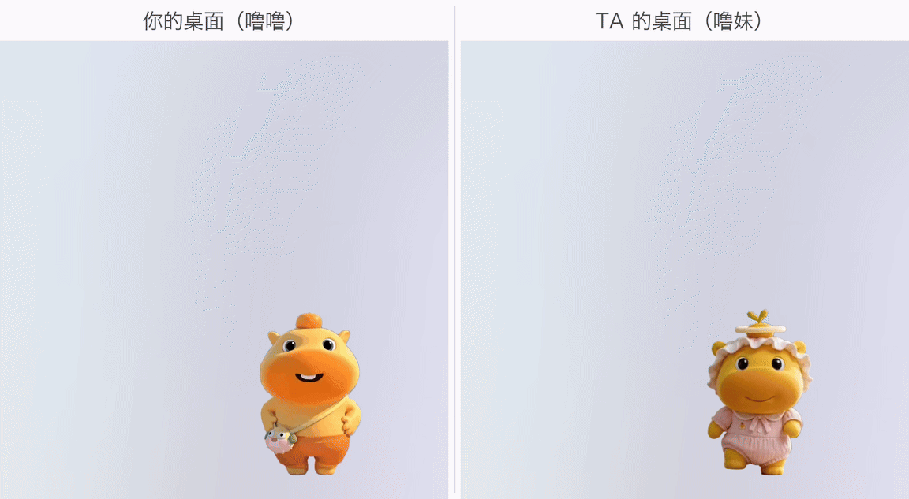

- **它做什么**：两个人几乎同时发东西时，先发的那只跑去对方家见面，然后两只一起走回先发的那边再见一面，
  最后后发的那只回家，把对方留下的话带给你。

## 勿扰模式和诚意清单

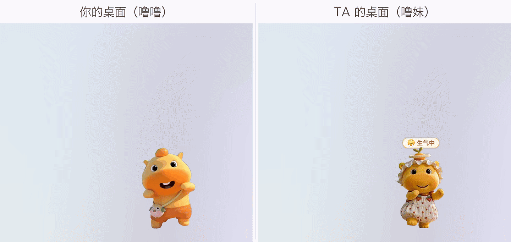

- **它做什么**：开着勿扰时，你的宠物安安静静站着，头上挂个小牌子；TA 发来的一切（爱心、串门、文字、表情）都先攒着，
  不跑来、不冒气泡、不出声，菜单栏显示 🍊N。勿扰结束时，TA 的宠物跑来送一张「诚意清单」：你勿扰的时候 TA 来找过你几次，
  各发了什么；点「看看」打开记录。
- **TA 开着勿扰时**：🍊 菜单显示「TA 勿扰中（😤 生气中）」；你照样能发，宠物跑出去再回来告诉你「TA 开了勿扰，先放在 TA 那儿啦」。
- **怎么用**：🍊 →「勿扰模式」→ 先在「心情」里选（😤 生气中 / 💼 忙碌中 / 😴 休息中 / 🤐 不说原因），
  再在「开启」里选多久（30 分钟 / 1 小时 / 今天之内 / 直到我关掉）。开着时菜单最上面是「关闭勿扰」。重启 App 也还开着，到点自动结束。

## 隐藏和全屏

- **隐藏**：🍊 →「隐藏」→ 5 分钟 / 30 分钟 / 1 小时 / 一直隐藏；或按 ⌃⌥L。时间到了自己出来，🍊 →「显示」或 ⌃⌥L 提前叫回。
- **你不在的时候**：隐藏期间 TA 发的消息不打扰你，🍊 旁边显示条数；宠物一出来，TA 的宠物带一张「你不在的时候，TA 来过～」小卡片跑来。
- **全屏时自动隐藏**：看视频、开会共享屏幕时，全屏的那块屏幕上宠物自动躲起来，退出全屏再出来。
  在 设置 → 通用 →「全屏时自动隐藏」里关掉。

## 换装

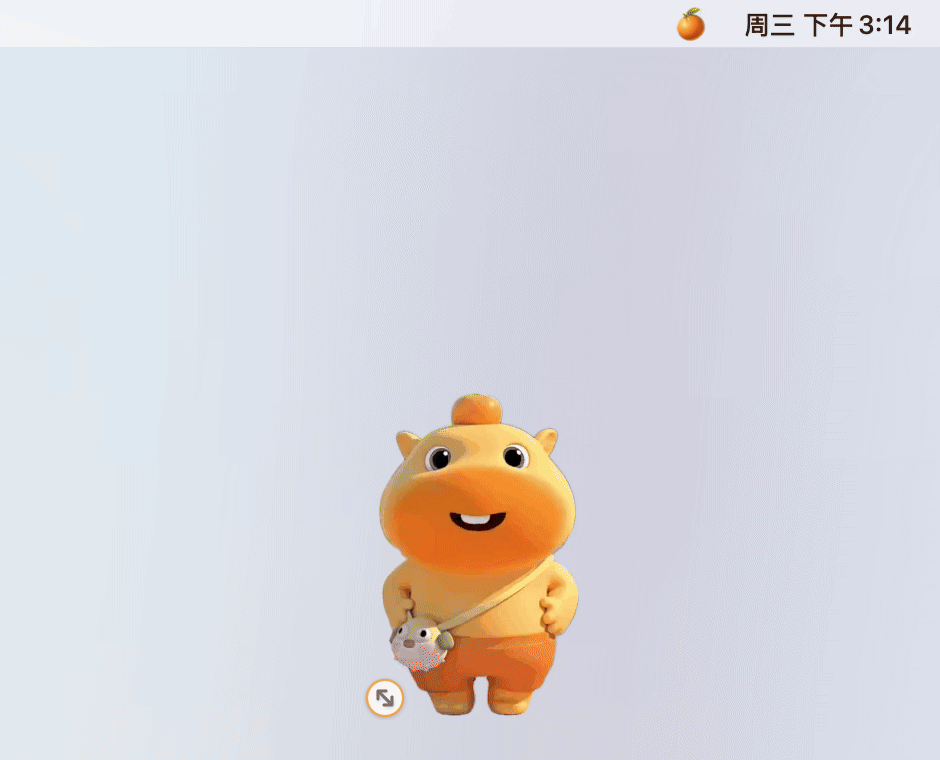

- **它做什么**：噜噜 11 套、噜妹 9 套造型，每 30 分钟自动换一套。节日限定：醒狮新年只在春节前后 15 天，圣诞树只在 12 月，
  当季时更常出现。
- **怎么用**（🍊 菜单或右键宠物）：
  - 「换个造型」随机换一套；「选择造型 ▸」直接挑；「换回上一个」回到之前那套（最多记 10 套）；
  - 「固定这套造型」不再自动换。

| 噜噜 | 噜妹 |
|---|---|
| 经典（默认）、小熊、熊猫、小蜜蜂、樱桃奶油帽、醒狮新年（春节限定）、印花睡衣、八方来财、圣诞树（12 月限定）、小狗帽、小黄帽 | 蕾丝帽（默认）、小香风、女仆、蓝睡帽小裙、小狮子蝴蝶结、蓝色花边帽、小天使、粉蝴蝶结毛线帽、粉兜帽 |

## 大小

- **怎么用**：鼠标移到宠物上，右下角出现一个小圆点，按住斜着拖就能等比例放大缩小（0.6×–1.6×，脚底不动）；
  或 🍊 →「大小」→ 小 / 标准 / 大 / 恢复默认大小。来串门的 TA、互动动画、爱心都跟着一起变。

## 番茄钟

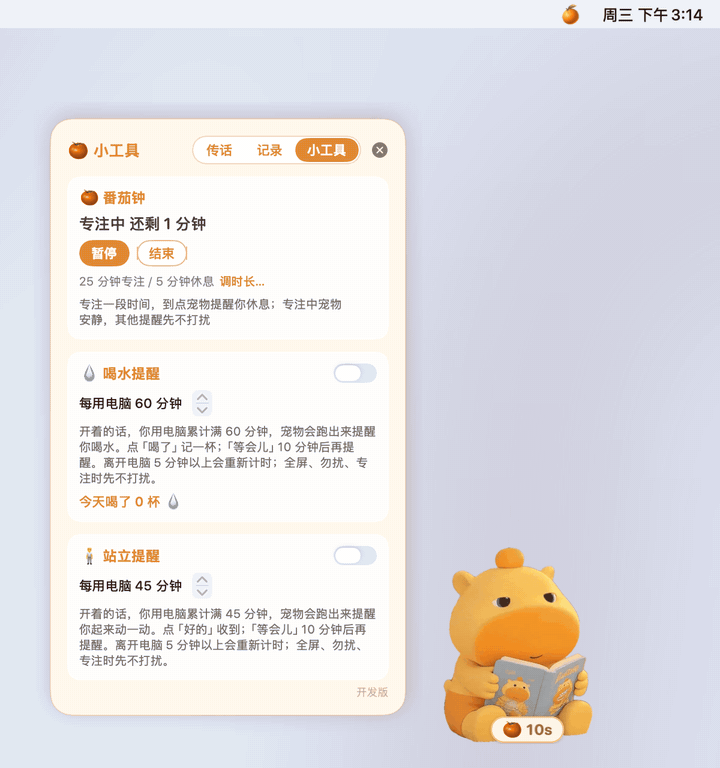

- **它做什么**：专注一段时间，到点宠物提醒你休息。专注时宠物捧着书安静陪你，身边显示倒计时；喝水 / 站立提醒先不打扰；
  TA 的消息先帮你攒着，专注结束后一起送来。TA 那边的菜单能看到「（你）正在专注 🍅 还剩 N 分钟」，这时 TA 发东西，宠物会回去告诉 TA
  「TA 在专注，先放在 TA 那儿啦」。
- **怎么用**：传话面板 →「小工具」→「开始专注」，或 🍊 →「番茄钟」→「开始专注」；中途可以「暂停 / 继续」「跳过休息」「结束」。
- **在哪里设置**：设置 →「小工具」：专注（默认 25 分钟）、短休息（5 分钟）、长休息（15 分钟）、几轮一次长休息（4 轮）。
  新的时长从下一个阶段开始算。

## 喝水 / 站立提醒

- **它做什么**：你用电脑累计满一段时间，宠物跑出来提醒你喝水或起来动一动。**只算你在用电脑的时间**：离开电脑 5 分钟以上重新计时；
  全屏、勿扰、专注时到点也先不打扰，等结束了再提醒。
- **怎么用**：提醒气泡上点「喝了 ✓」记一杯（「好的 ✓」表示站起来了），「等会儿」10 分钟后再提醒。今天喝了几杯在小工具页和 🍊 →「提醒」里看。
- **在哪里设置**：传话面板 →「小工具」，或 🍊 →「提醒」→「喝水提醒 💧 / 站立提醒 🧍」开关（默认关）；
  间隔在 设置 →「小工具」里改（默认喝水 60 分钟、站立 45 分钟）。小工具页会显示这一轮还差几分钟。

## 叫 TA 喝水 / 起来动动

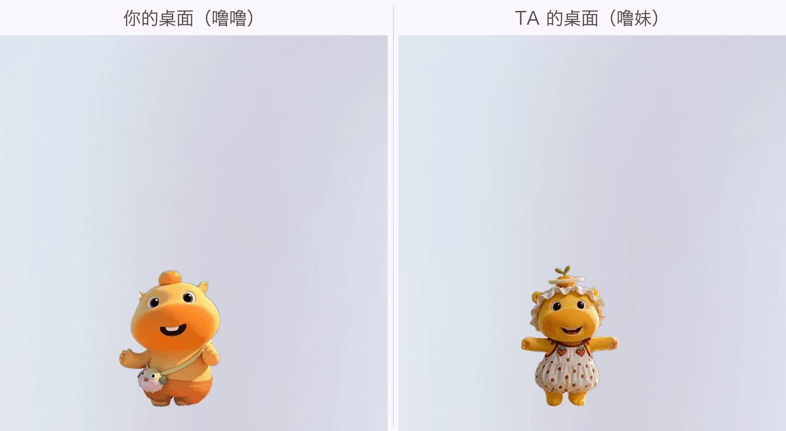

- **它做什么**：你的宠物跑到 TA 的桌面，TA 那边冒出「（你）叫你喝水啦 💧」，带「喝了 ✓ / 等会儿」两个按钮。
  TA 点了「喝了」或「等会儿」，答案都会带回来：你的宠物还在 TA 桌面时，回家的提示从「送到啦」变成「TA 说马上喝 💧」/「TA 说等会儿再喝 ⏰」
  （起来动动是「TA 说马上起来动动」/「TA 说等会儿再动」）；宠物已经在家，就在它头上冒一个同样的小气泡。
  TA 点了「等会儿」、过一会儿在自己的提醒上点「喝了 / 好的」（2 小时内），你会再收到「TA 终于喝啦 💧」/「TA 终于起来动啦」。「记录」里都有一行。
- **怎么用**：传话面板 →「传话」→「💧 叫 TA 喝水」或「🧍 叫 TA 起来动动」。两个人都要是 v0.10 以上；回话（马上 / 等会儿 / 终于）要 TA 也升到 v0.14.4，老版本的 TA 点「喝了」你照样收到，点「等会儿」你这边没有回话。

## 三种模式

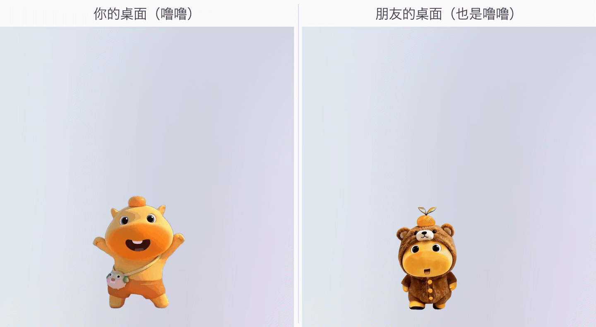

| 模式 | 适合 | 有什么 |
|---|---|---|
| 🧸 一个人 | 自己用 | 一只自己的宠物、小工具、换装、天气；不用配对，不用 Firebase。传话面板变成「表情」（让宠物演一个）和「小工具」 |
| 💕 情侣 | 两个人 | 一个噜噜、一个噜妹；串门、传话、亲亲、抱抱等全部互动 |
| 🤝 朋友 | 两个朋友 | 串门、传话、互动照样有，没有亲密动作；两个人可以选同一个角色（两只一样的见面时一起开心、冒爱心） |

- **怎么用**：第一次打开时在欢迎窗里选；之后在 设置 → 通用 →「模式」和「我的角色」里随时改，改了马上生效。
  情侣模式下换角色会先问你确认（角色决定你占哪一边）。
- 从旧版本升级上来的用户自动是情侣模式，什么都不用改。

## 天气卡、天气造型和想 TA 泡泡

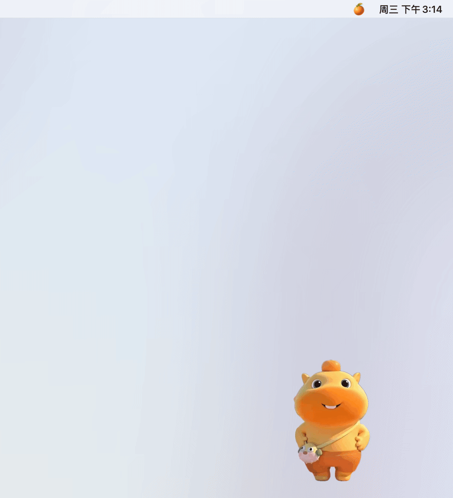

- **天气卡**：传话面板顶部，TA 和你两行：城市、当地时间、天气图标、温度和最高 / 最低温。还没选城市时显示「设置我的城市 ›」。
- **想 TA 泡泡**：宠物偶尔（大约每 20–40 分钟用电脑的时间）会「想 TA」，头顶冒出一朵云，里面是 TA 的角色和
  「TA 的城市 天气 温度 · 当地时间」；鼠标在宠物上停一秒左右也会冒。TA 那边开始下雨、下雪或变得很热时，会冒一句「TA 那边下雨啦」。
- **泡泡里的 TA 和 TA 桌面上一模一样**（v0.14.2）：每只宠物把「现在穿的造型」和「现在在干嘛」随心跳告诉对方（presence 的 `outfit` / `pose`，只发状态，不发画面）。
  泡泡里画的就是这套造型（TA 没发就用 TA 最近一条消息里的造型，再不行用该角色的默认造型）和这个状态：
  睡着了 = 闭眼定格 + 「z z」；省电静止 = 静止帧；番茄钟专注 = 噜噜捧书的片段（噜妹 / 没有这个片段的造型：静止帧 + 小番茄 🍅）；
  勿扰 = 静止帧 + TA 的勿扰牌（「😤 生气中」「🔕 勿扰中」…）；天气造型 = 撑伞 / 踩水等片段；隐藏或不在线 = 普通待机。
  TA 的宠物跑来串门时，如果消息里没带造型，也会穿 TA 现在的那套。
- **偷看**（v0.14.3）：传话面板天气卡下面的「👀 偷看」，或 🍊 菜单里的「偷看 TA 👀」。点一下马上去读一次 TA 的最新状态
  （不等 15–30 秒的轮询），然后冒出想 TA 泡泡，画 TA 此刻的造型、状态和天气；泡泡停 9 秒，点一下就收。
  你主动要看，所以不受 60 秒冷却、勿扰、专注、打盹的限制；TA 不在线时画 TA 最后的造型，下面写「TA 不在线」（有天气就带上）；
  从没见过 TA 时提示「还看不到 TA，等 TA 上线吧」；你的宠物正在串门时提示「TA 正在你这儿呢」；
  有对话气泡在显示时，等它收了再冒（不叠在一起）。偷看是纯本地读取，不会给 TA 发任何东西，TA 也看不到。一个人模式没有这个入口。
- **天气造型**：宠物会跟着你那边的天气偶尔换个样子（下雨、下雪、天热、天冷、刮风都不一样，比如噜妹下雨天顶着荷叶踩水）。
- **在哪里设置**：设置 → 通用 →「我的城市」（搜城市名，选好后点「更改」可以换）；这里也能看到 TA 的城市。
  只分享城市，不分享精确位置。
- **天气从哪来**（大约每 30 分钟更新一次）：在美国，当前温度和天气用附近气象站（25 公里内、90 分钟内）的实测数据，
  拿不到就退回 Open-Meteo 的预报模型；其他地方用 Open-Meteo。今天的最高 / 最低温一直来自 Open-Meteo。
  Open-Meteo 说「阴」但云量不到 85% 时显示「多云」，不再把晴天误报成阴天。
- **使用我现在的位置**（默认关）：设置 →「我的城市」→ 勾上「使用我现在的位置」，第一次会弹出系统的定位授权。
  打开后城市会自动跟着你走：启动时、电脑唤醒时、以及每隔几小时更新一次，移动超过约 3 公里才会重新查城市名。
  只在本机用大致位置查出城市名，TA 只看到城市名。手动选城市会关掉它。没授权时设置里会提示去
  系统设置 → 隐私与安全性 → 定位服务 里允许噜噜桌宠，并有按钮直接打开；这时仍用你手动选的城市。

## 更新日志和待设置

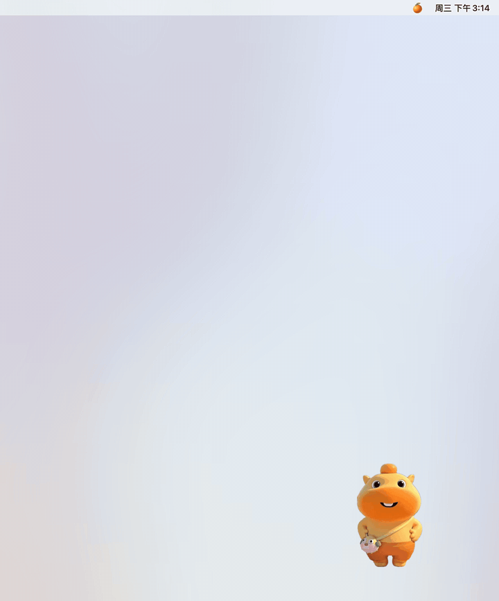

- **它做什么**：升级后宠物冒一张小卡片「升级到 vX 啦 · N 条新功能」，点「看看」打开更新日志窗口，新的版本标着「新」。
  「待设置」页列出还没设置的小事（比如设置我的城市、开启喝水 / 站立提醒、TA 的版本比你旧），每项可以「去设置」或「不用了」。
- **在哪里**：🍊 →「更新日志…」；有待设置时菜单里多一项「待设置（N）」。

## 版本提醒和更新

- 传话面板右下角显示当前版本；🍊 菜单里能看到 TA 正在用的版本。TA 升级到新版本后，你这边会冒个气泡提醒你也升级。
- **现在怎么更新**：到 Releases 下载新的 `LuluPet.zip`，🍊 →「退出」，把「应用程序」里的旧版替换成新的，再打开。
  聊天记录、设置、位置都会保留。
- **一键更新（v0.14 即将推出）**：🍊 菜单里会有「检查更新」，有新版本时直接下载替换。

## 声音

- 串门、抱抱、亲亲、爱心、气泡、生气、开心、打瞌睡等都有小音效，每次随机一个；有些互动带专属声音（比如抱抱时说「我想你了」）。
- 默认开、音量「小」；隐藏时完全不出声。可选背景音乐（默认关，启动时放一首，不循环）。
- **在哪里设置**：🍊 →「声音」（开 / 关、音量、背景音乐），或 设置 → 通用 →「声音」（有音量滑块和「试听」）。

## 快捷键

| 快捷键 | 作用 |
|---|---|
| ⌃⌥L | 显示 / 隐藏宠物（全屏时也能叫出来） |
| ⌃⌥M | 打开传话面板 |
| ⌃⌥Q | 退出噜噜桌宠（故意不用 ⌘Q，免得关面板时误退） |

在 设置 → 通用 →「快捷键和显示」里点一下框框，按新的组合键（要带 ⌃、⌥ 或 ⌘），Esc 取消；「恢复默认」改回原来的。

## 省电

- 闲着时宠物停成静止画面，动画交给系统画；锁屏、息屏、被完全挡住时停止一切动画。
- 用电池或低电量模式时，在线心跳、检测都会放慢，插上电源自动恢复。

## 设置一览

🍊 →「设置…」：

- **通用**：模式、我的角色、我的城市（以及 TA 的城市）、配对码（生成 / 粘贴 / 复制）、Firebase 数据库地址、
  快捷键、全屏时自动隐藏、在程序坞中显示图标、声音 / 音量 / 背景音乐。改完点最下面的「保存」（模式、角色、快捷键等会马上生效）。
- **小工具**：番茄钟时长、喝水 / 站立提醒开关和间隔，改了马上生效。

两个人配对的完整步骤见 [firebase-setup.md](firebase-setup.md)。

<!-- docs-synced: v0.14.4 -->
